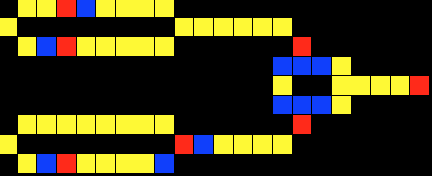

# Wireworld

[Wireworld](https://en.wikipedia.org/wiki/Wireworld) is a cellular automaton first proposed by Brian Silverman in 1987. It is particularly suited to simulating electronic logic elements, or "gates", and, despite the simplicity of the rules, Wireworld is Turing-complete.

This is a simple implementation in **Python**, with a basic GUI.

## Usage

    $ python ww.py source delay

Several samples are provided in the `circuits` folder. For example, an XOR gate with feeders with half second delay between each frame:

    $ python ww.py circuits/xor-generators.txt 500

## Highlights

* Basic window sizing capabilities. The window and block sizes are computed within certain boundaries to accommodate the wireworld (no window resize though)
* Adjustable delay

## Project Layout

* `engine.py`: the automaton
* `gui.py`: a Tkinter GUI

The project does not require any external dependencies.

## Rules

From [wikipedia](https://en.wikipedia.org/wiki/Wireworld): a Wireworld cell can be in one of four different states, usually numbered 0–3 in software, modeled by colors in the examples here:

    Empty (Black)
    Electron head (Blue)
    Electron tail (Red)
    Conductor (Yellow)

As in all cellular automata, time proceeds in discrete steps called generations (sometimes "gens" or "ticks"). Cells behave as follows:

    Empty → Empty
    Electron head → Electron tail
    Electron tail → Conductor
    Conductor → Electron head if exactly one or two of the neighbouring cells are electron heads, or remains Conductor otherwise.

## Author

[Youri Ackx](http://ackx.net)

## License

This project is licensed under the terms of the GNU GPL v3 license. [Full license text here](LICENSE.txt).
